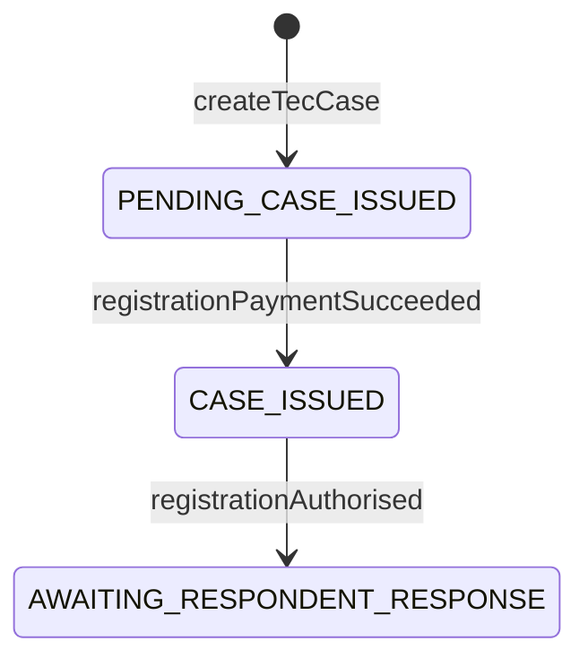
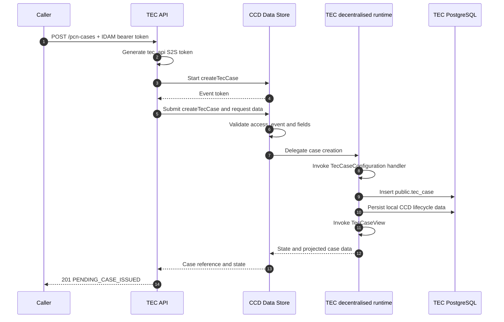
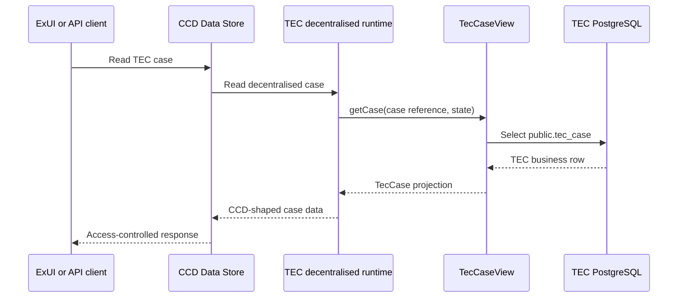

# TEC decentralised CCD architecture

This document describes the architecture implemented by this proof of concept. The repository is local-only: the
production topology below explains how the same components would fit together, but this repository does not deploy
them to an environment.

## Components

| Component | Responsibility | Where it runs |
| --- | --- | --- |
| TEC Spring Boot application | Exposes the caller-facing API, defines the `TEC` case type, handles delegated CCD events and owns the PCN business data | Port 4013 locally |
| `hmcts.ccd.sdk` Gradle plugin | Generates CCD definition JSON from the typed Java configuration | At build/configuration time |
| CCD decentralised runtime | Supplies `/ccd-persistence/**`, lifecycle persistence, event dispatch and `CaseView` integration | Embedded in TEC because `decentralised = true` |
| CCD Data Store and Definition Store | Validate the definition, enforce case access/events and route decentralised persistence to TEC | Started locally by CFTLib; platform services in production |
| CFTLib | Provides Gradle tasks and assembles the local CCD services, simulators and infrastructure | Local development only |

The central relationship is:

```text
The Java CCD configuration describes the contract.
CCD remains the case API and event orchestrator.
TEC owns the business data and handles delegated persistence.
CFTLib makes the integration runnable locally.
```

## TEC implementation

The relevant application classes are:

- `TecCase`: the CCD-facing data model.
- `CaseState`: the four states generated into the CCD definition.
- `UserRole`: the system and clerk access profiles.
- `TecCaseConfiguration`: the case type, access, tabs, search/work-basket fields, events and Java event handlers.
- `TecCaseRepository`: persistence of TEC-owned business data in `public.tec_case`.
- `TecCaseView`: reconstruction of a CCD-facing `TecCase` from the business table.
- `TecCaseController` and `TecCaseCreationService`: the caller-facing create API and its CCD Data Store client.

The application therefore has two API surfaces:

```text
Caller-facing API:       POST /pcn-cases
CCD-facing SDK runtime:  /ccd-persistence/**
```

The application owns the first. The embedded decentralised runtime supplies the second.

### Case type and access

The case type and jurisdiction IDs are both `TEC`. The current roles are:

| Java role | IDAM role | Case-type access | State access |
| --- | --- | --- | --- |
| `SYSTEM` | `caseworker-tec-system` | CRUD | CRUD in every state |
| `CLERK` | `caseworker-tec` | RU | Read and update in every state |

The events themselves grant mutation access only to the system role. The clerk receives read access to the creation
event but cannot trigger any configured event. Every event uses the condition `[STATE]="NEVER_SHOW"`, so none is
offered as an action in ExUI.

### States and events



`CLOSED` is defined and has role access, but no configured event currently enters it. There is no payment-failure
event in the current implementation.

The event handlers update TEC-owned data as follows:

| Event | Required event data | Business write | Resulting state |
| --- | --- | --- | --- |
| `createTecCase` | Registration-request fields; respondent lines 4–6 are optional | Inserts `public.tec_case`; `payment_status` defaults to `PENDING` | `PENDING_CASE_ISSUED` |
| `registrationPaymentSucceeded` | `paymentReference` | Sets payment status to `SUCCEEDED` and stores the reference | `CASE_ISSUED` |
| `registrationAuthorised` | `registrationDocument` | Stores the document value and the application server's current date | `AWAITING_RESPONDENT_RESPONSE` |

### Case presentation and search

`TecCaseConfiguration` generates two application tabs in addition to CCD's case-history tab:

- **Registration request**: identifiers, respondent lines, vehicle/offence details, certificate date and amount.
- **Registration workflow**: payment status/reference, closure reason, registration document and registration date.

Penalty charge number is the only configured search and work-basket input. Results include the case reference,
penalty charge number, respondent lines 1–3 and vehicle registration number.

The tab configuration is static CCD metadata. `TecCaseView` supplies the current values at runtime by loading the row
whose `case_reference` matches the CCD reference. ExUI and API clients call CCD; they do not call `TecCaseView`
directly.

## Definition generation and runtime

The relevant Gradle configuration is:

```groovy
ccd {
  configDir = file('build/ccd-definition')
  rootPackage = 'uk.gov.hmcts.reform.tecpoc'
  decentralised = true
  runtimeIndexing = false
}
```

`./gradlew generateCCDConfig` generates the current definition under `build/ccd-definition/TEC`. The JSON contains
CCD metadata; it does not contain the Java handlers. Existing files under `build/ccd-definition` are build output and
may include remnants from an older model unless the directory is cleaned first.

At runtime, the decentralised SDK:

- exposes the persistence and read callbacks used by CCD Data Store;
- dispatches submitted events to the handler registered with `decentralisedEvent(...)`;
- manages local CCD lifecycle data, revisions and event history in the `ccd` schema; and
- calls `TecCaseView` to obtain the current CCD-facing data.

Runtime Elasticsearch indexing is explicitly disabled.

## Create flow



TEC does not create a case by invoking its handler directly. `TecCaseCreationService` calls CCD's `startCase` and
`submitCaseCreation` APIs; the business insert happens when CCD delegates the event back to TEC.

## Read flow



## Local CFTLib topology

Run the local stack with:

```bash
./gradlew bootWithCCD
```

CFTLib starts the TEC application and real CCD service code in isolated classloaders, with Docker-based supporting
infrastructure and local IDAM/S2S simulators. The important local endpoints configured by this repository are:

| Service | Address |
| --- | --- |
| TEC API and callbacks | `http://localhost:4013` |
| CCD Data Store | `http://localhost:4452` |
| IDAM simulator | `http://localhost:5062` |
| S2S simulator | `http://localhost:8489` |
| Shared PostgreSQL server | `localhost:6432` |

The `tec` database is added to that PostgreSQL server. `TecCftLibConfiguration` then:

1. creates `caseworker`, `caseworker-tec-system` and `caseworker-tec` roles;
2. creates `tec-system@test.com` with system and clerk roles;
3. creates `tec-demo@test.com` with the clerk role;
4. generates and imports the `TEC` definition; and
5. creates a CCD profile for the demo user.

Local CCD routing is set on the CFTLib-launched services as:

```text
CCD_DECENTRALISED_CASE-TYPE-SERVICE-URLS_TEC=http://localhost:4013
```

In a production deployment, the equivalent route belongs to CCD Data Store configuration and points at the deployed
TEC service. The generated definition must also be imported through the environment's definition-release process.
CFTLib itself is not deployed.

## Source of truth

| Concern | Source of truth |
| --- | --- |
| Case type, fields, states, events, tabs and permissions | `TecCaseConfiguration`, `CaseState`, `UserRole` and `TecCase` |
| Definition used by the local CCD stack | Generated `build/ccd-definition/TEC` imported by `TecCftLibConfiguration` |
| PCN business data | `tec.public.tec_case` |
| Decentralised lifecycle metadata and event history | SDK-managed `tec.ccd` schema |
| Current CCD-facing field values | `TecCaseView` projection |
| Local users, roles and CCD profile | `TecCftLibConfiguration` |
| Local service URLs and CCD-to-TEC route | `build.gradle` and `application.yaml` |

## Repository map

- `build.gradle`: dependencies, CCD SDK settings, local CFTLib environment and test tasks.
- `src/main/java/uk/gov/hmcts/reform/tecpoc/ccd/`: case model, definition, handlers, view and repository.
- `src/main/java/uk/gov/hmcts/reform/tecpoc/http/`: caller-facing HTTP contract.
- `src/main/java/uk/gov/hmcts/reform/tecpoc/service/TecCaseCreationService.java`: CCD start/submit client.
- `src/main/resources/db/migration/V1__create_tec_case.sql`: TEC business schema.
- `src/cftlib/java/uk/gov/hmcts/reform/tecpoc/cftlib/TecCftLibConfiguration.java`: local setup and definition import.
- `bin/create-tec-case.sh`: local case-creation example.
